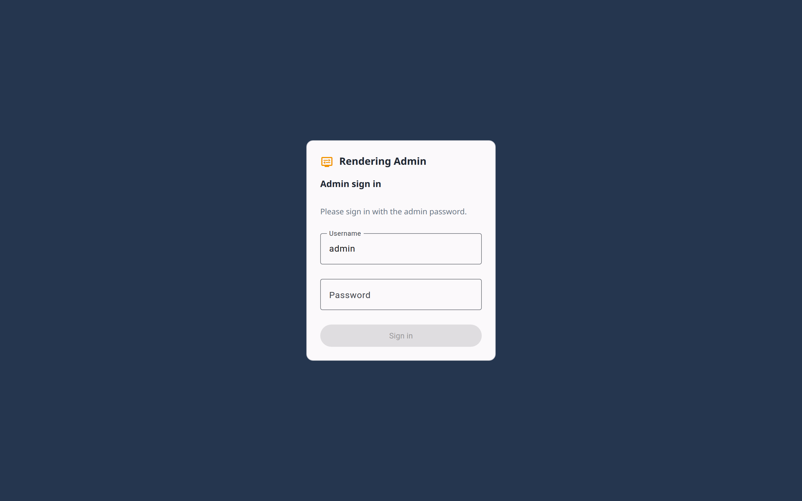
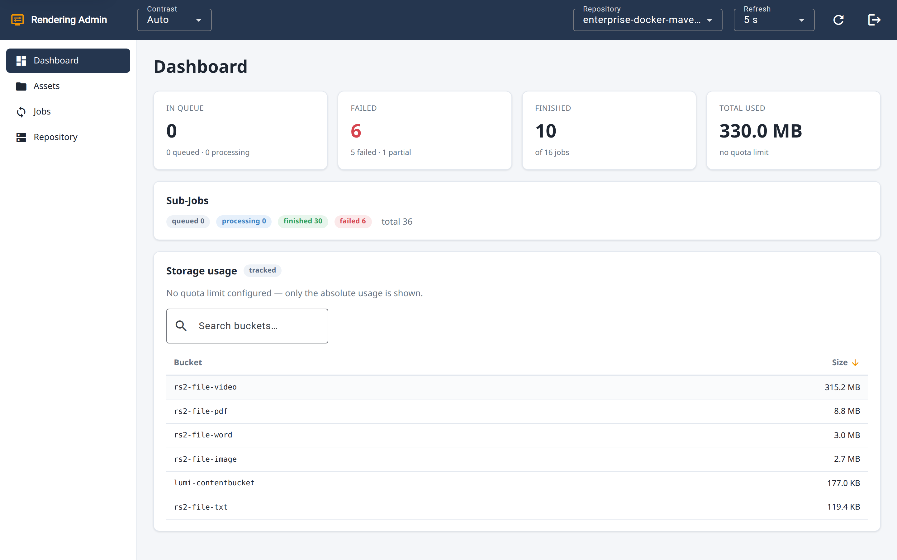
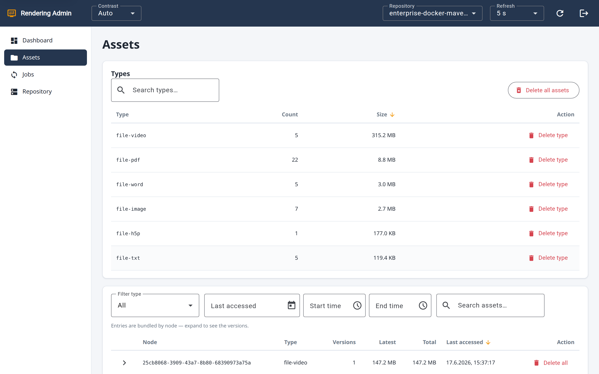
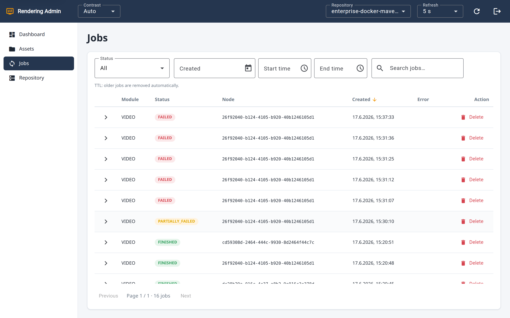
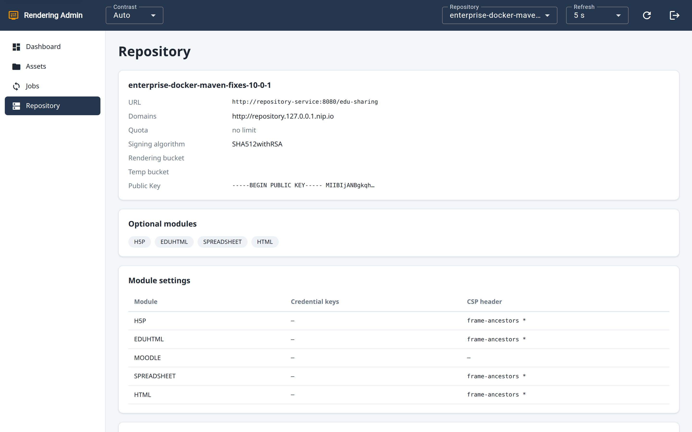
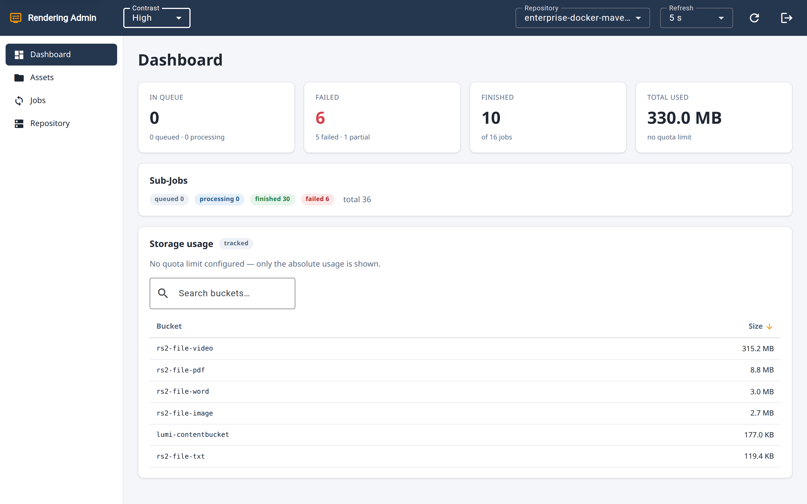

<!-- _class: lead -->
<!-- _paginate: false -->

# Rendering Admin

## Verwaltungsoberfläche für den edu-sharing Rendering-Service

Stakeholder-Überblick · Juni 2026

---

## Worum geht es?

- Der **Rendering-Service** konvertiert und rendert Inhalte:
  Bilder, Audio/Video, Dokumente, H5P, Jupyter-Notebooks.
- Speicherverbrauch, Verarbeitungs-Jobs und Fehler waren bislang
  nur schwer einsehbar — der Betrieb war eine **Blackbox**.
- **Rendering Admin** macht diesen Zustand sichtbar — und steuerbar:
  eine schlanke Weboberfläche für den laufenden Betrieb.

---

## Auf einen Blick

- Eigenständige Weboberfläche (**Angular 21**), eigener Container,
  hinter dem bestehenden Proxy — same-origin erreichbar.
- Greift über die **`/admin`-Schnittstelle** des Services auf die Daten zu.
- **Ein aktives Repository** als durchgängiger Arbeitskontext
  (oben jederzeit umschaltbar).
- **Echtzeit** dank Auto-Refresh · barrierefrei nach **WCAG 2.1/2.2 AA**.

---

<!-- _class: shot -->

## Anmeldung

- Sichere Anmeldung über ein **Admin-Konto** (HTTP-Basic).
- Nach dem Login werden die verfügbaren
  **Repositories geladen** und zur Auswahl gestellt.

---

<!-- _class: shot -->

## Dashboard — Zustand auf einen Blick

- **Echtzeit-Kennzahlen:** In queue · Failed · Finished · Total used.
- **Speicher-Auslastung** mit Ampel-Balken und Quota-Hinweis.
- **Drilldown** bis auf die einzelnen Storage-Buckets.

---

<!-- _class: shot -->

## Assets — Speicher gezielt verwalten

- **S3-Asset-Management** nach Typ und Knoten,
  inkl. Versionen und „last accessed".
- **Gezieltes Aufräumen:** löschen pro Typ, Knoten, Version
  oder alles — stets mit Bestätigung.
- **Filter** nach Typ, Zeitraum (von–bis) und Freitext.

---

<!-- _class: shot -->

## Jobs — Verarbeitung nachvollziehen

- Jeder Rendering-Job mit **Modul, Status, Node, Fehlertext**
  und aufklappbaren **Sub-Jobs** samt Fortschritt.
- Status-Badges: `QUEUED` · `PROCESSING` · `FINISHED` ·
  `FAILED` · `PARTIALLY_FAILED`.
- **Filter** nach Status und Zeitraum; alte Jobs verfallen
  automatisch (TTL).

---

<!-- _class: shot -->

## Repository — zentrale Konfiguration

- **Auf einen Blick:** URL, Domains, Quota, Buckets,
  Signatur-Algorithmus, Public Key.
- **Aktivierte Module** (H5P, EduHTML, …) mit ihren
  CSP- und Credential-Einstellungen.
- **CORS-Konfiguration** inkl. letzter Synchronisation.

---

<!-- _class: shot -->

## Bedienkomfort & Barrierefreiheit

- **Repository-Umschalter** und einstellbares **Refresh-Intervall**
  (Off … 60 s; pausiert im Hintergrund-Tab).
- **Kontrast-Modus** Auto / High / Normal — **WCAG 2.1/2.2 AA**;
  der Marken-Look bleibt Standard.
- **Skip-Link** und Fokus-Management für Tastatur- und
  Screenreader-Nutzung.

---

## Nutzen & Fazit

- **Transparenz** — Fehler und Speicherverbrauch sind sofort sichtbar.
- **Kontrolle** — gezieltes Aufräumen statt manueller Eingriffe im Hintergrund.
- **Fokus** — ein klares Werkzeug pro Repository, durchgängig barrierearm.
- **Einsatzbereit** — und offen für Feedback zu den nächsten Schritten.

---

<!-- _class: lead -->
<!-- _paginate: false -->

# Vielen Dank

## Fragen & Feedback willkommen

edu-sharing · Rendering Admin
