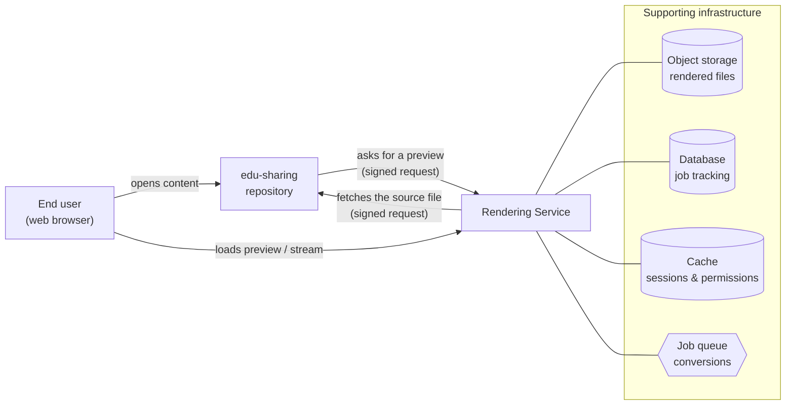
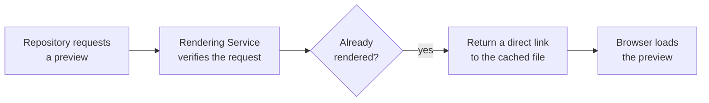
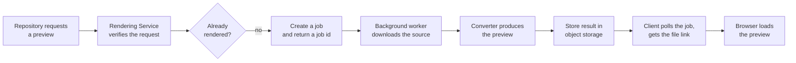
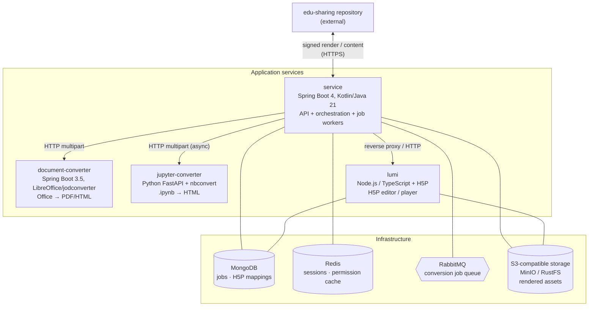
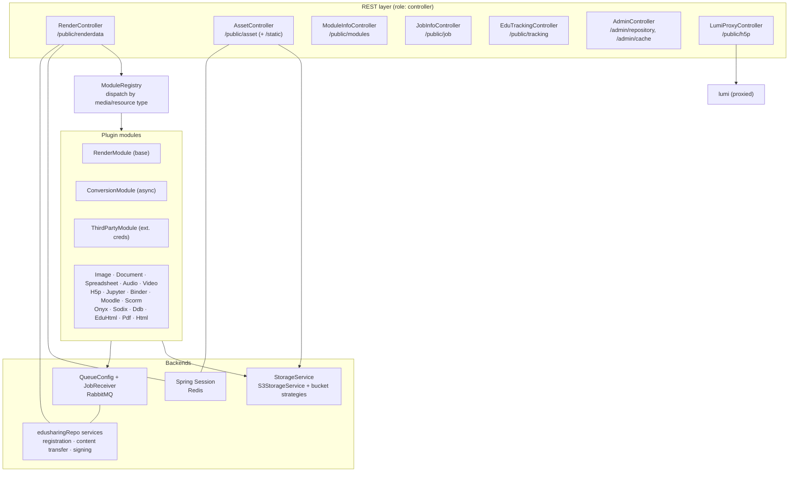
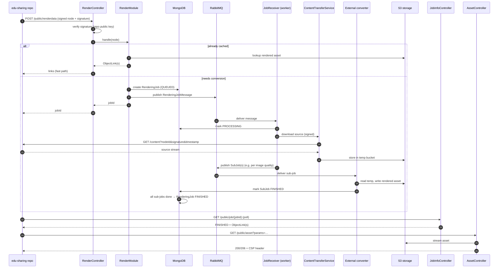
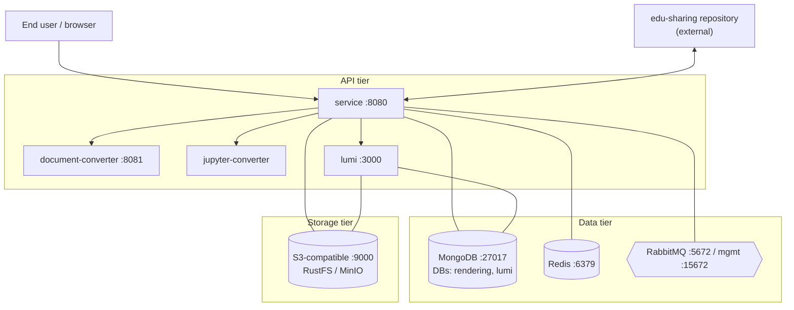

# edu-sharing Rendering Service — Architecture

> **Status:** Living document · **Audience:** customers (Part A) and internal/engineering (Part B)
> **Format:** Markdown with embedded [Mermaid](https://mermaid.js.org/) diagrams.
> In **Confluence Cloud** the `mermaid` code blocks render natively; on **Server/Data Center**
> install the *Mermaid Diagrams for Confluence* app (see [§11 Confluence import notes](#11-confluence-import-notes)).

---

# Part A — Overview (for customers)

## 1. What is the Rendering Service?

The **edu-sharing Rendering Service** turns content stored in an edu-sharing repository into a form that
can be displayed safely and quickly in a web browser. When a user opens a learning object, the repository
asks the Rendering Service for a *preview* or *playable* representation. The service:

- **converts** the source file into a web-friendly format when needed (for example an Office document into
  a PDF or HTML preview, or a Jupyter notebook into an HTML page),
- **caches** the result so the same conversion is not repeated, and
- **serves** the rendered content back to the browser (with streaming support for audio and video).

It supports a broad range of content: **images**, **audio & video**, **Office documents & spreadsheets**,
**PDF** and **HTML**, **H5P** interactive content, **Jupyter notebooks**, **Moodle / SCORM** activities,
and external OER sources such as **Sodix** and the **Deutsche Digitale Bibliothek (DDB)**.

The service is **multi-tenant**: several edu-sharing repositories can register with one Rendering Service,
each with its own access keys, storage quota, and set of enabled content types.

## 2. System context

**How to read it:** the repository and the user both talk to the Rendering Service. Every request between
the repository and the service is cryptographically signed, so neither side trusts unverified input. The
service keeps rendered files in object storage, tracks long-running conversions in a database, caches
sessions and access permissions, and uses a queue to process heavy conversions in the background.

## 3. Supported content types

| Content type | Source examples | Rendered as |
|---|---|---|
| **Images** | JPEG, PNG, TIFF, … | Multiple resolutions/qualities for fast display |
| **Audio / Video** | MP3, MP4, … | Streamed directly (HTTP range / partial content) |
| **Office documents** | DOC(X), PPT(X), ODT, ODP, RTF, TXT | PDF or HTML preview (via LibreOffice) |
| **Spreadsheets** | XLS(X), ODS, CSV | PDF or HTML preview |
| **PDF / HTML** | PDF, HTML | Served directly, no conversion |
| **H5P** | `.h5p` packages | Interactive H5P player |
| **Jupyter notebooks** | `.ipynb` | Interactive HTML page |
| **Moodle / SCORM** | Moodle activities, SCORM packages | Embedded Moodle / SCORM player |
| **OER sources** | Sodix, DDB, EduHTML, Onyx, Binder | Embedded or linked representation |

## 4. How a rendering request works

There are two paths. If the content has already been rendered, the answer is instant. If not, the service
converts it in the background and the client picks up the result when it is ready.

**Fast path — already cached:**

**Conversion path — first time / not cached:**

For some types the work is split into parallel pieces — e.g. an image is rendered into several resolutions
at once, and the job is "finished" only when all pieces are done.

---

# Part B — Technical appendix (internal)

## 5. Component architecture

Four runtime services plus shared infrastructure. The main `service` orchestrates; the three converters are
stateless workers reached over HTTP.

| Service | Stack | Default port | Talks to |
|---|---|---|---|
| `service` | Spring Boot 4.0.x, Kotlin 2.3, Java 21 | 8080 (mgmt 9080) | MongoDB, Redis, RabbitMQ, S3, the 3 converters, edu-sharing repo |
| `document-converter` | Spring Boot 3.5.x + LibreOffice (jodconverter) | 8081 | (stateless; reads/writes S3 via the service) |
| `jupyter-converter` | Python 3.12+, FastAPI, nbconvert | 9120 / 8000 | (stateless) |
| `lumi` | Node.js 20+, TypeScript, `@lumieducation/h5p-*` | 3000 | MongoDB (`lumi` DB), S3 |

> `document-converter` is **deliberately** pinned to Spring Boot 3.5.x — jodconverter has no Boot 4 release yet.

## 6. Service-internal architecture

**Module dispatch.** `ModuleRegistry` indexes every module by MIME type, resource type, replication source,
and remote-repository type. Resolution order: `node.mediatype` → `repository.repositoryType` →
`ccm:replicationsource` → `ccm:ccresourcetype` → MIME-type prefix; an unmatched node raises
`ObjectTypeNotSupportedException`. Modules implement `RenderModule` (synchronous), and optionally
`ConversionModule` (produces background sub-jobs) and/or `ThirdPartyModule` (external credentials, e.g. H5P).

**Deployment roles.** Beans are activated by `@ConditionalOn…` annotations that read the `app.roles`
property (comma-separated). The roles are **`master`**, **`controller`**, **`converter`**, **`job-manager`**
(plus an AV-converter variant). This lets the same artifact run as:

| Mode | `app.roles` | Runs |
|---|---|---|
| All-in-one | `master,controller,converter,job-manager` | API + workers + housekeeping |
| API only | `controller` | Public endpoints, no async processing |
| Worker only | `converter,job-manager` | Queue consumers + converters, no public API |
| Master | `master` | Cache cleaner, registration, scheduled housekeeping |

## 7. End-to-end job flow

**Sub-job fan-out.** A `ConversionModule` may split one job into several `SubJob`s — the canonical example
is `ImageRenderModule`, which renders multiple resolutions in parallel. `MainJobLogic` flips the parent
`RenderingJob` to `FINISHED` only once every `SubJob` completes. `RenderingJob` documents carry a **TTL
index (~6h)** so completed/stale jobs expire automatically.

## 8. Deployment topology

- **Docker Compose** (dev/test): one stack; standalone Redis, standalone MongoDB, **RustFS** as the
  S3-compatible store. Files: `deploy/docker/compose/src/main/compose/*.yml`. Edit only `src/`; `target/` is generated.
- **Kubernetes / Helm** (production): per-component charts under `deploy/docker/helm/*`. Adds **Redis Cluster**,
  optional **Istio** (VirtualService/DestinationRule/Gateway), an optional **Varnish** caching sidecar,
  **HPA**, and a choice of **MinIO or RustFS** for object storage. External traffic enters only via `service`.

## 9. Security model

- **Request signing.** Every `POST /public/renderdata` carries a Base64 node payload + RSA signature. The
  service verifies it against the registered repository's **public key** (`RepositoryPublicKeyService`,
  cached). Outbound content fetches are signed with the service's **private key** (`EncryptionService`),
  so the repository can verify the caller.
- **Authentication & sessions.** A JWT filter authenticates `/public/**`; sessions (incl. the Spring
  Security context) are stored in **Redis** via Spring Session, serialized as JSON (Jackson 3).
- **Filter chains.** `/public/**` → JWT; `/admin/**` → HTTP Basic (admin user). Method-level
  `@PreAuthorize`/`@PostAuthorize` enforce node read/download permissions; permissions are cached per
  session with a per-module TTL (e.g. `app.session.image.nodePermissionExpirationTime`).
- **Content-Security-Policy.** Each module supplies its own CSP header (configurable per repository,
  e.g. H5P `frame-ancestors`), applied on every `AssetController` response for safe iframe embedding.

## 10. External integrations & data stores

| System | Role | Notes |
|---|---|---|
| **MongoDB** | Job tracking (`RenderingJob`, `SubJob`), H5P node↔content mappings | TTL index on jobs (~6h); per-module DBs `rendering` and `lumi` |
| **Redis** | HTTP sessions + security context; node-permission cache; repository public-key cache | Standalone (`spring.redis.standalone.*`) or cluster (`spring.redis.cluster.*`) — project-specific prefixes |
| **RabbitMQ** | Async conversion job queue (topic exchange, per-module routing keys) | `JobReceiver` consumes; module-specific receivers handle sub-jobs |
| **S3 (MinIO/RustFS)** | Cached rendered assets + temp conversion buckets | Bucket strategies: per-customer, per-media-type, external-customer-bucket; `CacheCleaner` evicts on quota |
| **edu-sharing repository** | Source of content; registers with the service | Registration via `/admin/repository/register`; signed `GET /content` for source files |

## 11. Confluence import notes

- **Confluence Cloud:** paste this file's content (or each `mermaid` block) into a page — Mermaid renders
  natively. Markdown can be brought in via *Insert → Markdown* or the *Markdown* macro.
- **Confluence Server / Data Center:** install the **Mermaid Diagrams for Confluence** app, then put each
  diagram inside its Mermaid macro. Alternatively export diagrams to SVG/PNG
  (e.g. `npx @mermaid-js/mermaid-cli -i ARCHITECTURE.md -o architecture.svg`) and attach the images.
- **Two-audience split:** **Part A** is self-contained and free of internal class names — copy it to a
  customer-facing page on its own. Keep **Part B** on an internal page.
