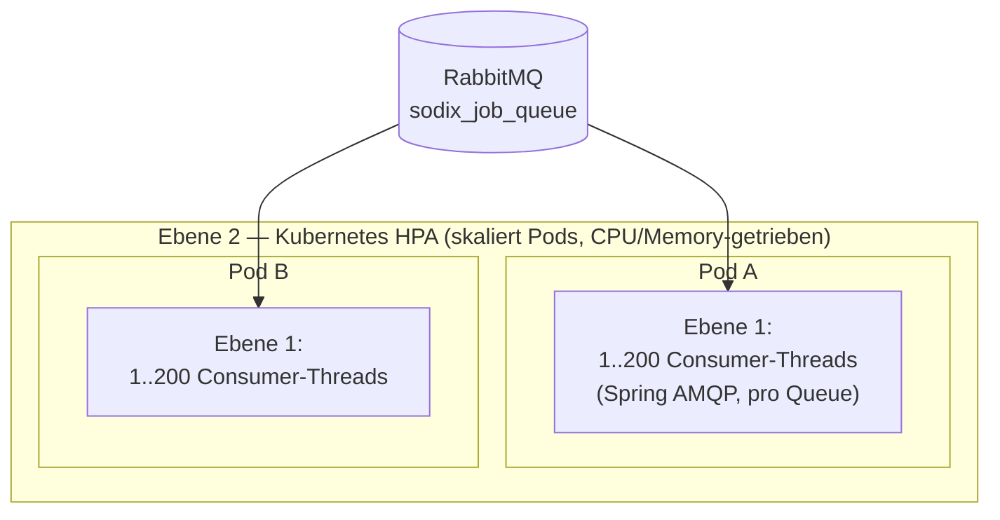
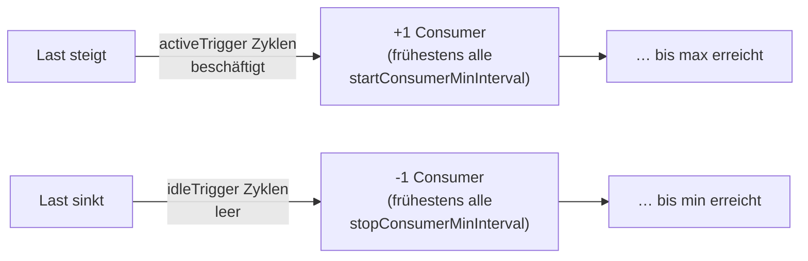
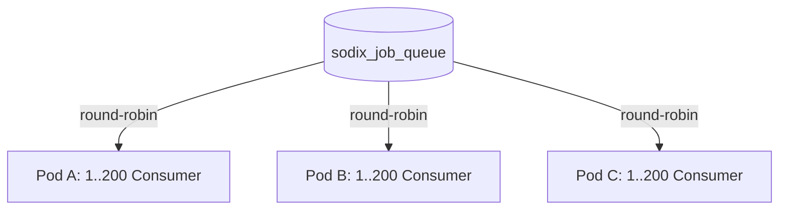

# Queue-Skalierung — Betriebsdokumentation

Wie der rendering2-Service RabbitMQ-Jobs parallel abarbeitet und wie sich der Durchsatz
skalieren lässt. Zielgruppe: DevOps / Betrieb. Ergänzt [`ARCHITECTURE.md`](ARCHITECTURE.md).

---

## TL;DR

- Jeder Service-Pod verarbeitet Jobs mit einem Pool aus **Consumer-Threads** pro Queue. Die
  Pool-Größe ist entweder **fest** (z. B. `10`) oder ein **Auto-Scaling-Bereich** (`1-200`).
- Die drei leichten API-Passthrough-Queues **`sodix`, `omega`, `ddb`** sind auf **Burst**
  getunt: Bereich `1-200`, `prefetch=3`, aggressive Scaling-Geschwindigkeit. Sie fahren bei
  Last schnell hoch und danach schnell wieder runter.
- Es gibt **zwei unabhängige Skalierungsebenen**: Consumer-Threads *innerhalb* eines Pods
  (Spring AMQP) und die **Pod-Anzahl** selbst (Kubernetes HPA). Sie wissen nichts voneinander.
- Alle Pods konkurrieren als **competing consumers** um dieselbe Queue. `prefetch` steuert,
  wie fair sich die Last über die Pods verteilt.
- Einstellbar über `application.properties`, Helm-Values und Umgebungsvariablen — **pro Queue
  getrennt**.

---

## 1. Die zwei Skalierungsebenen



| Ebene | Was skaliert | Wodurch gesteuert | Regelgröße |
|---|---|---|---|
| **1** | Consumer-**Threads** je Queue innerhalb eines Pods | Spring AMQP `SimpleMessageListenerContainer` | `app.queue.<queue>.concurrency` (`min-max`) |
| **2** | Anzahl **Pods** | Kubernetes HPA (`hpa.yaml` im Helm-Chart) | CPU-/Memory-Auslastung |

Die beiden greifen ineinander, laufen aber **unabhängig**: HPA startet Pods, jeder Pod fährt
*seine eigene* Consumer-Skalierung hoch. Diese Doku behandelt vor allem **Ebene 1** und das
**Zusammenspiel über Pods** (Abschnitt 4).

---

## 2. Ebene 1 — Consumer-Threads pro Instanz (das `1-200`)

Jede Queue wird von einem `SimpleMessageListenerContainer` (SMLC) bedient. Ein **Consumer** =
ein Thread mit eigenem AMQP-Channel, der Nachrichten empfängt und den Handler ausführt (bei
sodix/omega/ddb ein blockierender HTTP-Call). Mehr Consumer = mehr parallele Jobs.

Die Consumer-Zahl kommt aus `app.queue.<queue>.concurrency`:

- **Feste Zahl** – z. B. `"10"` → immer exakt 10 Consumer.
- **Bereich** – z. B. `"1-200"` → **Auto-Scaling**: der Container startet mit `min` (1) und
  fährt bei Last bis `max` (200) hoch, bei Leerlauf wieder runter.

> Nur ein Bereich (`min-max`) aktiviert Auto-Scaling. Eine feste Zahl bleibt konstant.

### Der Auto-Scaling-Algorithmus

Jeder Consumer pollt die Queue in Zyklen. Ein Zyklus dauert maximal `receiveTimeout`
(**Framework-Default 1000 ms**): kommt eine Nachricht, gilt der Zyklus als *aktiv*, sonst als
*idle*. Vier Knöpfe steuern, wie der Container darauf reagiert:

**Hochskalieren (+1 Consumer):**
- Ein Consumer war `consecutiveActiveTrigger` Zyklen **in Folge aktiv** (durchgehend
  beschäftigt), **und**
- seit dem letzten Consumer-Start sind mindestens `startConsumerMinInterval` ms vergangen.
- → genau **ein** neuer Consumer wird gestartet (nie mehr als einer pro Intervall).

**Herunterskalieren (−1 Consumer):**
- Ein Consumer war `consecutiveIdleTrigger` Zyklen **in Folge idle**, **und**
- seit dem letzten Consumer-Stopp sind mindestens `stopConsumerMinInterval` ms vergangen,
  **und**
- die aktuelle Consumer-Zahl ist größer als `min`.
- → **ein** Consumer wird gestoppt.



Wichtig: Skalierung erfolgt **schrittweise (±1)** und **ratenbegrenzt** durch die
`*MinInterval`-Werte. Die Zahl der Consumer springt nicht — sie wächst/schrumpft in Ein-Schritt-
Intervallen.

---

## 3. Prefetch × Concurrency — die häufigste Fehlannahme

`prefetch` (`app.queue.<queue>.prefetch`) ist die Zahl unbestätigter Nachrichten, die ein
Consumer **lokal puffert**. Der entscheidende Punkt:

> **`prefetch` gilt PRO Consumer, nicht global.**

Bei Volllast gilt also:

```
in-flight-Nachrichten pro Pod = concurrency × prefetch
```

Beispiel sodix bei Volllast: `200 Consumer × prefetch 3 = bis zu 600` Nachrichten, die dieser
eine Pod aus der Queue gezogen hat — davon **200 aktiv in Verarbeitung** (eine je Consumer-
Thread), der Rest wartet in den lokalen Puffern der Consumer.

Zweck von `prefetch > 1`: den Broker-Roundtrip *zwischen zwei kurzen Jobs desselben Consumers*
sparen. Dieser Effekt ist schon bei kleinem `prefetch` (2–3) gesättigt. **Ein hoher `prefetch`
bei hoher `concurrency` ist schädlich**, weil `concurrency × prefetch` sich multipliziert:
mehr RAM, schlechtere Lastverteilung über Pods (siehe Abschnitt 4). Deshalb steht `prefetch`
für die leichten Queues bewusst auf **3**, nicht höher.

Für die schweren Konvertierer (image, document, av, …) bleibt `prefetch` bei **1** (Default):
bei ungleich langen Jobs sorgt das für faire Verteilung (kein Consumer hortet Nachrichten,
während ein anderer frei ist).

---

## 4. Zusammenspiel über Instanzen — competing consumers

Es gibt **eine** Queue im Broker. **Alle** Consumer **aller** Pods sind gleichberechtigte
Konkurrenten darauf (RabbitMQ „competing consumers"):



Konsequenzen für den Betrieb:

1. **Kein globaler Koordinator.** Jeder Pod entscheidet seine Consumer-Skalierung nur anhand
   *seiner eigenen* Auslastung. Der theoretische Maximalpool ist `Pods × 200`.
2. **Round-robin nur an Consumer mit freier Kapazität.** Ein Consumer bekommt die nächste
   Nachricht nur, wenn seine unbestätigten Nachrichten `< prefetch` sind. Damit ist **`prefetch`
   der Fairness-Regler zwischen Pods**: kleiner `prefetch` (3) → Last verteilt sich gleichmäßig;
   großer `prefetch` → ein früh gestarteter Pod zieht viele Nachrichten in seine Puffer, bevor
   ein neuer Pod etwas abbekommt.
3. **Gepufferte Nachrichten sind „gebunden".** Was ein Consumer geprefetcht hat, ist für andere
   Pods unsichtbar, bis er sie bestätigt oder stirbt. Bei Pod-Crash werden unbestätigte
   Nachrichten vom Broker requeued — **außer** solchen, die der Handler mit einer Exception
   abgelehnt hat (`defaultRequeueRejected=false`: keine Redelivery-Schleife, die Nachricht wird
   verworfen und der Job als FAILED markiert).
4. **Keine Reihenfolge-Garantie** über mehrere Consumer/Pods — unkritisch, da Ergebnisse
   idempotent pro `nodeId/hash` in S3 landen.

**⚠ Rate-Limit externer APIs:** Bei `N` Pods können bis zu `N × 200` gleichzeitige Calls gegen
die Sodix-/Omega-/DDB-API laufen. Hat die externe API ein Limit, **`max` niedriger setzen**
(z. B. `1-50`) statt der vollen `1-200`.

---

## 5. Wo stelle ich was ein — Config-Referenz

Alle drei Ebenen setzen dieselben Spring-Properties; sie überschreiben einander in dieser
Reihenfolge (später gewinnt): `application.properties` (Code-Default) → Helm-Values / Env.

### Spring-Properties (Code-Default in `application.properties`)

```properties
app.queue.sodix.concurrency=1-200          # Consumer-Bereich (Auto-Scaling)
app.queue.sodix.prefetch=3                  # Puffer pro Consumer
app.queue.sodix.scaling.startConsumerMinInterval=1000   # Scaling-Geschwindigkeit
app.queue.sodix.scaling.stopConsumerMinInterval=1000
app.queue.sodix.scaling.consecutiveActiveTrigger=1
app.queue.sodix.scaling.consecutiveIdleTrigger=3
```

(analog für `omega` und `ddb` — **jede Queue wird unabhängig konfiguriert**.)

### Helm-Values (`values.yaml`)

```yaml
config:
  queue:
    concurrency:
      sodix: "1-200"
    prefetch:
      sodix: "3"
    scaling:
      sodix:
        startConsumerMinInterval: "1000"
        stopConsumerMinInterval: "1000"
        consecutiveActiveTrigger: "1"
        consecutiveIdleTrigger: "3"
```

Das ConfigMap-Template rendert daraus die Spring-Keys (`app.queue.sodix.concurrency`,
`app.queue.sodix.scaling.startConsumerMinInterval`, …).

### Umgebungsvariablen (compose / direkt)

| Env-Variable | Spring-Property | Default |
|---|---|---|
| `RENDERING2_QUEUE_SODIX_CONCURRENCY` | `app.queue.sodix.concurrency` | `1-200` |
| `RENDERING2_QUEUE_SODIX_PREFETCH` | `app.queue.sodix.prefetch` | `3` |
| *(keine dedizierte Env-Var)* | `app.queue.sodix.scaling.*` | siehe Defaults |

Die Scaling-Knöpfe haben keine eigene `RENDERING2_*`-Indirektion. Sie sind bei Bedarf direkt
als dotted-key setzbar (in Helm über die `config.queue.scaling`-Map, in compose als
`app.queue.sodix.scaling.startConsumerMinInterval: "500"`).

---

## 6. Die Burst-Defaults erklärt

Werte für sodix/omega/ddb gegenüber den Spring-AMQP-Framework-Defaults:

| Knopf | Framework-Default | **Burst-Default** | Effekt |
|---|---|---|---|
| `concurrency` | `1` | **`1-200`** | Auto-Scaling bis 200 parallele Consumer |
| `prefetch` | `1` | **`3`** | kleiner Puffer, spart Roundtrip, bleibt fair |
| `startConsumerMinInterval` | `10000` ms | **`1000` ms** | +1 Consumer/s statt /10 s → **20× schnellerer Ramp-up** |
| `consecutiveActiveTrigger` | `10` | **`1`** | reagiert schon auf den ersten voll ausgelasteten Zyklus |
| `stopConsumerMinInterval` | `60000` ms | **`1000` ms** | −1 Consumer/s → schneller Abbau nach dem Burst |
| `consecutiveIdleTrigger` | `10` | **`3`** | ~3 s Idle-Grace gegen Flapping bei Mikro-Pausen |

**Verhalten bei einem Last-Burst (pro Pod):**
- **Hoch:** reagiert in ~1–2 s auf ankommende Last, +1 Consumer/Sekunde bis 200
  (voller Ramp ~200 s statt ~33 min mit den Framework-Defaults).
- **Runter:** ~3 s Idle-Grace, dann −1 Consumer/Sekunde zurück auf 1, sobald die Queue leer läuft.

---

## 7. Tuning-Leitfaden & Fallstricke

| Situation | Empfehlung |
|---|---|
| Externe API hat ein Rate-Limit | `max` senken (`1-50`), nicht `prefetch` erhöhen. Gilt **pro Pod** — bei `N` Pods entsprechend teilen. |
| Ramp-up soll noch schneller | `startConsumerMinInterval` weiter senken (z. B. `500`). Kostet mehr Channel-Öffnungen. |
| Zu viel Flapping (hoch/runter-Pendeln) | `consecutiveIdleTrigger` erhöhen (mehr Grace) **oder** `stopConsumerMinInterval` erhöhen (langsamerer Abbau). |
| Kapazität nach Burst länger halten | `stopConsumerMinInterval` erhöhen (z. B. `30000`). |
| RAM-Druck auf den Pods | `prefetch` **nicht** erhöhen; ggf. `max` senken. Merke: RAM ∝ `concurrency × prefetch`. |
| Ungleiche Lastverteilung über Pods | `prefetch` niedrig halten (3). Hoher prefetch = ein Pod hortet. |
| Reihenfolge/Exactly-once nötig | Nicht über diesen Mechanismus lösen — Ergebnisse sind idempotent pro `nodeId/hash`. |

**Nicht anfassen ohne Grund:** Die schweren Konvertierer-Queues (image, document, av, jupyter,
eduHtml — feste `concurrency`, `prefetch=1`) sind bewusst konservativ. `prefetch=1` garantiert
dort faire Verteilung bei ungleich langen Jobs.

---

## 8. Referenz — alle Knöpfe

| Property | Typ | Bedeutung | Gilt für |
|---|---|---|---|
| `app.queue.<q>.concurrency` | `"n"` oder `"min-max"` | feste Consumer-Zahl oder Auto-Scaling-Bereich | alle Queues |
| `app.queue.<q>.prefetch` | Int | unbestätigte Nachrichten **pro Consumer** | sodix, omega, ddb (sonst 1) |
| `app.queue.<q>.scaling.startConsumerMinInterval` | ms | Mindestabstand zwischen Consumer-**Starts** | sodix, omega, ddb |
| `app.queue.<q>.scaling.stopConsumerMinInterval` | ms | Mindestabstand zwischen Consumer-**Stopps** | sodix, omega, ddb |
| `app.queue.<q>.scaling.consecutiveActiveTrigger` | Int | beschäftigte Zyklen bis **+1** Consumer | sodix, omega, ddb |
| `app.queue.<q>.scaling.consecutiveIdleTrigger` | Int | leere Zyklen bis **−1** Consumer | sodix, omega, ddb |

Unset gelassene Scaling-Knöpfe fallen auf den Spring-AMQP-Framework-Default zurück
(start 10000 / stop 60000 / beide Trigger 10 / receiveTimeout 1000).

---

## 9. Code-Landkarte (für Entwickler)

| Baustein | Datei | Rolle |
|---|---|---|
| Geteilte Listener-Factory | `renderingJob/queue/QueueConfig.kt` (`queueListenerContainerFactory`) | erzeugt die SMLC, sammelt per-Queue-Tuning via `ContainerCustomizer` ein |
| Tuning-Schnittstelle | `renderingJob/queue/QueueContainerConfig.kt` | pro Queue ein Bean, das den Container anpasst |
| Convenience-Basisklasse | `renderingJob/queue/TunableQueueContainerConfig.kt` | wendet `prefetch` + `scaling` auf den Container an |
| Config-Objekt | `renderingJob/queue/QueueProperties.kt` (+ `BurstScaling`) | bündelt `name`, `prefetch`, `scaling` einer Queue |
| Modul-lokale Bindung | `modules/{sodix,omega,ddb}/{Sodix,Omega,Ddb}QueueProperties.kt` | `@ConfigurationProperties("app.queue.<q>")`-Subklasse pro Queue |
| Container-Config | `modules/{sodix,omega,ddb}/{…}QueueConfig.kt` | reicht die Properties an die Basisklasse |

`name`, `key` und `concurrency` werden zusätzlich als SpEL-Placeholder direkt im
`@RabbitListener` des jeweiligen Receivers gelesen (Annotationsattribute können kein injiziertes
Objekt lesen), deshalb bleiben diese Keys flach und sind **nicht** Teil von `QueueProperties`.

Deploy-Mapping (Env → Property) siehe [`../deploy/CLAUDE.md`](../deploy/CLAUDE.md).
