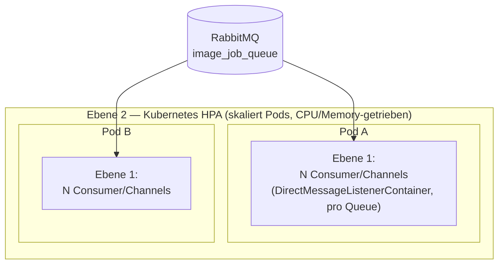
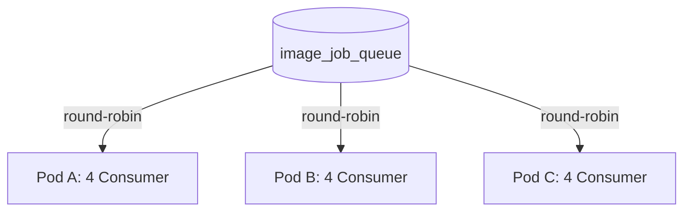

# Queue-Skalierung — Betriebsdokumentation

Wie der rendering2-Service RabbitMQ-Jobs parallel abarbeitet und wie sich der Durchsatz
skalieren lässt. Zielgruppe: DevOps / Betrieb. Ergänzt [`ARCHITECTURE.md`](ARCHITECTURE.md).

> **Stand nach dem DMLC-Umbau (Juli 2026).** Frühere Versionen dieser Doku beschrieben ein
> `SimpleMessageListenerContainer`-Auto-Scaling (`min-max`-Consumer-Bereiche, `BurstScaling`,
> `startConsumerMinInterval`, …). Diese Mechanik existiert **nicht mehr** — alle Queues laufen
> jetzt über `DirectMessageListenerContainer` (DMLC) mit einer **festen** Consumer-Zahl pro
> Queue und ohne Ramp-up. Die Klassen `QueueContainerConfig`/`TunableQueueContainerConfig` und
> die `scaling.*`-Properties gibt es nicht mehr.

---

## TL;DR

- Jede Queue registriert eine **feste** Anzahl Consumer (Channels) pro Pod — kein Auto-Scaling,
  kein Ramp-up. Ein Lastschub wird sofort auf alle konfigurierten Consumer verteilt.
- Es gibt **drei Queue-Modi** (`QueueMode`): **STANDARD** (ein Channel pro Consumer),
  **REMOTE** (sodix/omega/ddb: ein Channel pro Pod, K parallele Aufrufe über virtuelle Threads),
  **SINGLE_ACTIVE** (h5p-import: genau ein aktiver Consumer clusterweit).
- Es gibt **zwei unabhängige Skalierungsebenen**: die Consumer-Zahl pro Queue *innerhalb* eines
  Pods (statisch, per Config) und die **Pod-Anzahl** selbst (Kubernetes HPA). Sie wissen nichts
  voneinander.
- **Eine versteckte Falle:** Ohne `QueueConfig.rabbitConnectionFactoryExecutorPostProcessor`
  kollabiert die tatsächliche Nebenläufigkeit *aller* Queues zusammen auf **1** — unabhängig von
  jeder `concurrency`-Einstellung. Siehe Abschnitt 3.
- `prefetch` ist für STANDARD/SINGLE_ACTIVE-Queues **ein globaler Wert** (`app.queue.prefetch`,
  Default `1`), für REMOTE-Queues **pro Queue** und an `concurrency` gekoppelt.
- Einstellbar über `application.properties`, Helm-Values (`config.queue.*`) und
  Umgebungsvariablen — **pro Queue getrennt** über `app.queue.<queue>.concurrency`.

---

## 1. Die zwei Skalierungsebenen



| Ebene | Was skaliert | Wodurch gesteuert | Regelgröße |
|---|---|---|---|
| **1** | Consumer/**Channels** je Queue innerhalb eines Pods | `DirectMessageListenerContainer`, sofort und vollständig registriert | `app.queue.<queue>.concurrency` (feste Zahl, kein Bereich) |
| **2** | Anzahl **Pods** | Kubernetes HPA (`hpa.yaml` im Helm-Chart) | CPU-/Memory-Auslastung |

Die beiden greifen ineinander, laufen aber **unabhängig**: HPA startet Pods, jeder Pod registriert
sofort seine volle konfigurierte Consumer-Zahl je Queue — es gibt keinen Warm-up. Diese Doku
behandelt vor allem **Ebene 1** und das **Zusammenspiel über Pods** (Abschnitt 5).

---

## 2. Wie ein Consumer tatsächlich läuft (DMLC, kein Auto-Scaling)

Jede STANDARD/SINGLE_ACTIVE-Queue wird über die eine geteilte
`queueListenerContainerFactory` (`renderingJob/queue/QueueConfig.kt`) bedient. Der
`@RabbitListener` jedes Receivers registriert direkt `concurrency` Consumer (= Channels) beim
Broker — alle auf einmal, beim Start des Containers:

```kotlin
@RabbitListener(
    bindings = [ QueueBinding(value = Queue(name = "#{imageQueueProperties.name}", ...), ...) ],
    containerFactory = "queueListenerContainerFactory",
    concurrency = "#{imageQueueProperties.effectiveConcurrency}"
)
```

Es gibt **keinen** Ramp-up-Algorithmus, keine `min-max`-Bereiche, keine `*MinInterval`-Werte
mehr. Ein Lastschub wird sofort auf alle registrierten Consumer verteilt; ein Consumer, der
nichts zu tun hat, hält nur einen (billigen) Channel offen, keinen Thread.

**Die eine echte Falle** liegt woanders: `DirectMessageListenerContainer` nutzt seinen eigenen
`taskExecutor` (`QueueConfig.rabbitConsumerExecutor`, virtuelle Threads) nur, um die Consumer
beim Start zu *registrieren* — die eigentliche Nachrichtenverarbeitung (`handleDelivery`) läuft
synchron auf dem Thread, den der RabbitMQ-Java-Client aus seinem **eigenen,
verbindungsweiten** `ConsumerWorkService` nimmt. Ohne Eingriff ist dieser Pool aus
`Runtime.availableProcessors()` abgeleitet — auf einem cgroup-limitierten Pod (`converter`
z. B. bei ≤1000m CPU) rundet das auf **1** auf, sodass *jede* Queue der gesamten Verbindung
sequenziell abgearbeitet wird, unabhängig von `concurrency`. Der Fix ist
`QueueConfig.rabbitConnectionFactoryExecutorPostProcessor` — ein `BeanPostProcessor`, der die
`CachingConnectionFactory` direkt auf einen virtuellen-Thread-Executor umstellt. Der k6-Lasttest
(`../loadtest/README.md`) verifiziert das über die Metrik `rendering_queue_consumers_active`.
**Nicht anfassen, ohne den Lasttest erneut zu fahren** — ein `ConnectionFactoryCustomizer`
sieht wie der "richtige" Spring-Boot-Hook aus, greift aber nachweislich nicht (siehe
Doc-Kommentar in `QueueConfig.kt`).

---

## 3. Die drei Queue-Modi (`QueueMode`)

Der Modus ist **keine** Betriebs-Stellschraube, sondern eine fachliche Eigenschaft der Queue,
fest im Code über die Basisklasse der jeweiligen `@ConfigurationProperties`-Klasse
(`renderingJob/queue/QueueSpec.kt`):

| Modus | Beispiel-Queues | Channels/Pod | Wie parallelisiert |
|---|---|---|---|
| **STANDARD** | image, document, av, moodle, onyx, binder, h5p-lookup, jupyter, eduHtml, job | `concurrency` (1:1 zu Consumern) | jeder Consumer verarbeitet synchron auf seinem eigenen Channel |
| **REMOTE** | sodix, omega, ddb | **1** (fest) | `concurrency` (=K) ist die Broker-`prefetch` **und** die Größe des dedizierten HTTP-Connection-Pools; die eigentliche Arbeit läuft auf virtuellen Threads über `AsyncAckDispatcher` — MANUAL-Ack, ein Channel bedient bis zu K Nachrichten gleichzeitig |
| **SINGLE_ACTIVE** | h5p-import | 1 (erzwungen) | `x-single-active-consumer=true` im Queue-Argument: clusterweit genau ein aktiver Consumer (Lumi importiert eine Datei zur Zeit) |

**REMOTE im Detail** (sodix/omega/ddb — sie lösen nur einen Link/eine Referenz auf externes
Material auf, kein Datei-Download): Skalierung erfolgt bewusst über **mehr Pods (HPA)**, nicht
über ein höheres K pro Pod — K bleibt moderat (Default `50`), sonst würde der geteilte
Broker-Kanalraum knapp und der dedizierte Reactor-Netty-Pool (`WebClientConfig`) müsste
mitwachsen. Jede Remote-Queue hat ihre **eigene** `RemoteListenerContainerFactorySupport`-Factory
(MANUAL-Ack statt AUTO) statt der geteilten `queueListenerContainerFactory`.

**⚠ Rate-Limit externer APIs:** Bei `N` Pods können bis zu `N × K` gleichzeitige Calls gegen die
Sodix-/Omega-/DDB-API laufen. Hat die externe API ein Limit, `concurrency` (K) senken statt die
Pod-Zahl zu deckeln.

---

## 4. Prefetch

| Modus | Prefetch-Quelle | Property |
|---|---|---|
| STANDARD / SINGLE_ACTIVE | **ein globaler Wert** für alle Queues auf der geteilten Factory (eine `DirectRabbitListenerContainerFactory`-Instanz wendet ihr Prefetch auf jeden Container an — kein Per-Queue-Override möglich) | `app.queue.prefetch` (Default `1`) |
| REMOTE | **pro Queue**, faktisch = `concurrency` (K), da ein Prefetch-Slot den ganzen Job (HTTP → Mongo/S3 → Ack) länger belegt als nur den HTTP-Anteil | `app.queue.<sodix\|omega\|ddb>.prefetch` (optional, Default = `concurrency`; `@PostConstruct`-Validierung erzwingt `prefetch >= concurrency`) |

Für STANDARD-Queues bleibt `prefetch=1` bewusst konservativ: bei ungleich langen Jobs sorgt das
für faire Verteilung über Pods (kein Consumer hortet Nachrichten, während ein anderer frei ist).

---

## 5. Zusammenspiel über Pods — competing consumers

Es gibt **eine** Queue im Broker. **Alle** Consumer **aller** Pods sind gleichberechtigte
Konkurrenten darauf (RabbitMQ „competing consumers"):



Konsequenzen für den Betrieb:

1. **Kein globaler Koordinator.** Jeder Pod registriert einfach seine konfigurierte
   Consumer-Zahl; der Gesamtpool ist `Pods × concurrency`.
2. **Round-robin nur an Consumer mit freier Kapazität.** Ein Consumer bekommt die nächste
   Nachricht nur, wenn seine unbestätigten Nachrichten `< prefetch` sind.
3. **Gepufferte Nachrichten sind „gebunden".** Was ein Consumer geprefetcht hat, ist für andere
   Pods unsichtbar, bis er sie bestätigt oder stirbt. Bei Pod-Crash werden unbestätigte
   Nachrichten vom Broker requeued — **außer** solchen, die der Handler mit einer Exception
   abgelehnt hat (`defaultRequeueRejected=false`: keine Redelivery-Schleife, die Nachricht wird
   verworfen; der Job wird durch den betroffenen Receiver oder — falls dieser abstürzt, bevor er
   das kann — durch `StaleJobReaper` als `FAILED`/`TIMEOUT` reconciled, siehe Abschnitt 6).
4. **Keine Reihenfolge-Garantie** über mehrere Consumer/Pods — unkritisch, da Sub-Jobs
   unabhängig sind und Ergebnisse idempotent pro `nodeId/hash` in S3 landen.

---

## 6. Resilienz rund um die Queue (Kurzüberblick)

Diese Doku behandelt primär Durchsatz/Skalierung; die folgenden Bausteine sichern das
Verhalten bei Verlust einer Nachricht, eines Pods oder eines Broker-Knotens ab — Details in den
jeweiligen Klassen, hier nur die Fundstellen:

- **Publisher Confirms + Returns** (`QueueConfig.amqpTemplate`, `spring.rabbitmq.publisher-confirm-type`/
  `publisher-returns`): eine unroutbare oder vom Broker nicht bestätigte Publish wird laut geloggt
  statt still zu verschwinden.
- **`StaleJobReaper`** (`renderingJob/StaleJobReaper.kt`, master-only, `@Scheduled`): reaped
  orphane `PROCESSING`-Sub-Jobs (crashter Consumer) **und** — als Sicherheitsnetz — Sub-Jobs bzw.
  Hauptjobs, die ungewöhnlich lange `QUEUED` hängen (verlorene Publish oder eine beim
  Broker-Neustart geleerte transiente Queue). Timeouts: `app.jobreaper.default-max-process-time`
  (PT30M) und `app.jobreaper.default-max-queued-time` (PT6H — großzügig genug für einen legitimen
  Backlog z. B. bei HPA-Scale-up-Verzögerung; sodix/omega/ddb brauchen **keinen** längeren
  Per-Queue-Override, obwohl sie andernorts als „Import-Queues" bezeichnet werden — jeder Job ist
  nur 1-2 schnelle REST-Calls, die einen Link/eine Referenz auflösen, kein Download, daher
  drainiert selbst ein großer Backlog bei K=50/Pod in Minuten. `app.jobreaper.max-queued-time.<key>`
  bleibt als Escape Hatch für eine zukünftige Queue mit echtem Lang-Backlog).
- **Redelivery-Guards** in den Receivern (`if (subJob.status != SubJobStatus.QUEUED) return`,
  analog `H5pLookupReceiver`): verhindern, dass eine erneut zugestellte Nachricht (z. B. Ack
  verloren, obwohl der Job schon fertig war) externe Seiteneffekte wiederholt (Moodle-Import,
  Onyx-Upload, Sodix-/Omega-/DDB-API-Calls, Binder-Git-Upload).
- **`shutdownTimeout`** auf beiden Container-Factories + `terminationGracePeriod` im
  Helm-Chart: lässt eine laufende Konvertierung bei Pod-Stop/Rolling-Deploy zu Ende laufen,
  statt sie mitten in der Verarbeitung abzubrechen (nur für STANDARD/SINGLE_ACTIVE wirksam — bei
  REMOTE-Queues kehrt der Listener durch `AsyncAckDispatcher` sofort zurück, siehe dessen
  Doc-Kommentar).

---

## 7. Wo stelle ich was ein — Config-Referenz

Alle Ebenen setzen dieselben Spring-Properties; sie überschreiben einander in dieser Reihenfolge
(später gewinnt): `application.properties` (Code-Default) → Helm-Values / Env.

### Spring-Properties (Code-Default in `application.properties`)

```properties
app.queue.prefetch=1                    # global, STANDARD/SINGLE_ACTIVE
app.queue.image.concurrency=4           # STANDARD: registrierte Consumer/Pod
app.queue.sodix.concurrency=50          # REMOTE: K (HTTP-Pool + Broker-Prefetch)
# app.queue.sodix.prefetch=              # optional, Default = concurrency
```

(analog für jede Queue — **jede wird unabhängig konfiguriert**, siehe die vollständige Liste in
`application.properties`.)

### Helm-Values (`values.yaml`)

```yaml
config:
  queue:
    prefetch: "1"
    concurrency:
      image: "4"
      sodix: "50"
    remotePrefetch:
      sodix: ""   # leer = aus concurrency abgeleitet
```

Das ConfigMap-Template rendert daraus die Spring-Keys (`app.queue.image.concurrency`, …).

### Umgebungsvariablen (compose / direkt)

| Env-Variable | Spring-Property | Bedeutung |
|---|---|---|
| `RENDERING2_QUEUE_PREFETCH` | `app.queue.prefetch` | globaler Prefetch (STANDARD/SINGLE_ACTIVE) |
| `RENDERING2_QUEUE_<KEY>_CONCURRENCY` | `app.queue.<key>.concurrency` | der eine Skalierungsknopf je Queue |
| `RENDERING2_QUEUE_<KEY>_PREFETCH` (nur sodix/omega/ddb) | `app.queue.<key>.prefetch` | optionaler REMOTE-Prefetch-Override |

Vollständige Env→Property-Tabelle: [`../deploy/CLAUDE.md`](../deploy/CLAUDE.md).

---

## 8. Tuning-Leitfaden & Fallstricke

| Situation | Empfehlung |
|---|---|
| Externe API (sodix/omega/ddb) hat ein Rate-Limit | `concurrency` (K) senken, nicht `prefetch`. Gilt **pro Pod** — bei `N` Pods entsprechend teilen. |
| Durchsatz einer STANDARD-Queue erhöhen | `concurrency` erhöhen (mehr Channels/Pod) **oder** mehr Pods (HPA) — es gibt keinen automatischen Ramp mehr, die Änderung wirkt sofort ab dem nächsten Pod-Start. |
| RAM-/Channel-Druck auf den Pods | `concurrency` **nicht** blind erhöhen — mehr Channels je Pod summieren sich über alle Queues eines Pods (`converter`-Rolle: 13 Receiver). `spring.rabbitmq.cache.channel.size` entsprechend mitziehen. |
| Ungleiche Lastverteilung über Pods | `prefetch` niedrig halten (STANDARD: `1`). Hoher Prefetch = ein Pod hortet Nachrichten. |
| Reihenfolge/Exactly-once nötig | Nicht über diesen Mechanismus lösen — Sub-Jobs sind unabhängig, Ergebnisse idempotent pro `nodeId/hash`. |
| Queue-Leader-Verteilung im Cluster wirkt schief | Kein Consumer-Tuning-Thema — `queue_leader_locator` am Broker prüfen (`rabbitmqctl list_queues name leader`), siehe das RabbitMQ-Resilienz-Audit. |

**Nicht anfassen ohne den k6-Lasttest erneut zu fahren:**
`QueueConfig.rabbitConnectionFactoryExecutorPostProcessor` (Abschnitt 2) — sieht harmlos aus,
ist aber der einzige Grund, warum `concurrency` überhaupt etwas bewirkt.

---

## 9. Code-Landkarte (für Entwickler)

| Baustein | Datei | Rolle |
|---|---|---|
| Geteilte STANDARD/SINGLE_ACTIVE-Factory | `renderingJob/queue/QueueConfig.kt` (`queueListenerContainerFactory`) | erzeugt den `DirectMessageListenerContainer`; feste `concurrency`, globaler `prefetch` |
| Verbindungsweiter Concurrency-Fix | `renderingJob/queue/QueueConfig.kt` (`rabbitConnectionFactoryExecutorPostProcessor`) | ersetzt den RabbitMQ-Java-Client-`ConsumerWorkService` durch virtuelle Threads (siehe Abschnitt 2) |
| Publish-Resilienz | `renderingJob/queue/QueueConfig.kt` (`amqpTemplate`) | `mandatory` + Returns-/Confirm-Callback |
| REMOTE-Factory | `renderingJob/queue/RemoteListenerContainerFactorySupport.kt` | MANUAL-Ack-Factory für sodix/omega/ddb, je Modul instanziiert |
| Async-Verarbeitung (REMOTE) | `renderingJob/queue/AsyncAckDispatcher.kt` | entkoppelt Consume von Processing, ackt nach Abschluss auf virtuellem Thread |
| Modus + Skalierungsknopf | `renderingJob/queue/QueueSpec.kt` (`QueueMode`, `StandardQueueProperties`/`RemoteQueueProperties`/`SingleActiveQueueProperties`) | ein `concurrency`-Feld, Semantik je nach Modus |
| Geteilte Skalare | `renderingJob/queue/QueueProperties.kt` | `app.queue.{topicExchange,controllerBroadcastExchange,prefetch}` |
| Job-Queue-Bindung | `renderingJob/queue/JobQueueProperties.kt` | `app.queue.job.*` |
| Modul-lokale Bindung | `modules/{sodix,omega,ddb,h5p,moodle,...}/*QueueProperties.kt` | `@ConfigurationProperties("app.queue.<q>")`-Subklasse pro Queue |
| Stuck-Job-Sicherheitsnetz | `renderingJob/StaleJobReaper.kt` + `JobReaperProperties.kt` | reaped orphane PROCESSING/QUEUED (sub-)jobs |

`name`, `key` und `concurrency` werden zusätzlich als SpEL-Placeholder direkt im
`@RabbitListener` des jeweiligen Receivers gelesen (Annotationsattribute können kein injiziertes
Objekt lesen), deshalb bleiben diese Keys flach in `QueueSpec` statt in einer separaten Map.

Deploy-Mapping (Env → Property) siehe [`../deploy/CLAUDE.md`](../deploy/CLAUDE.md).
